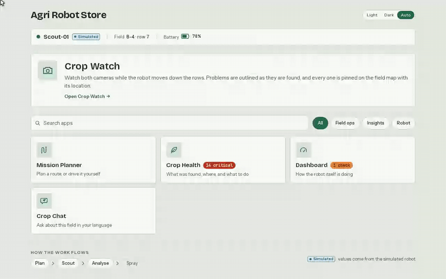
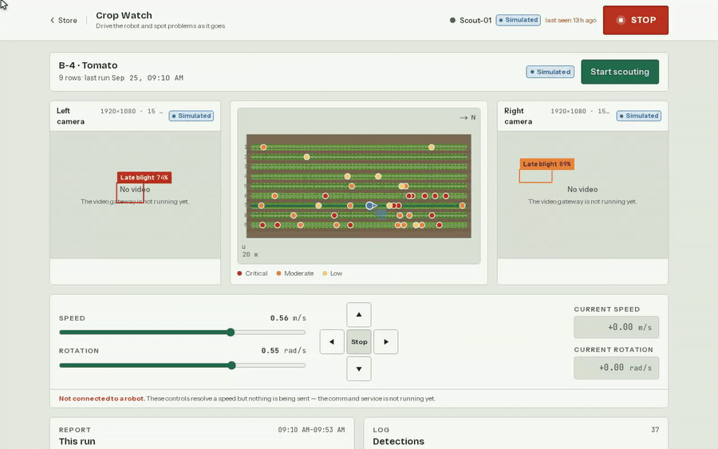
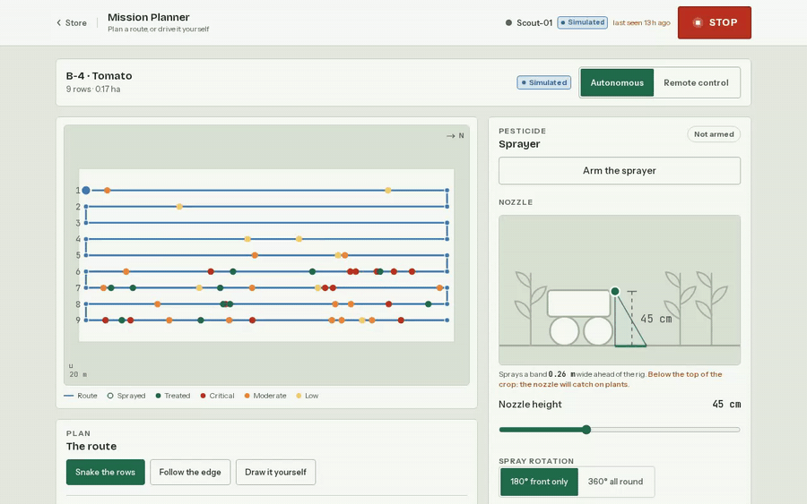
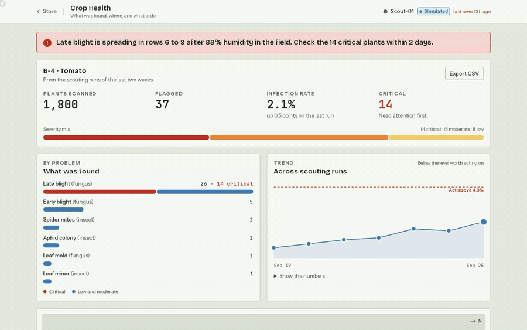
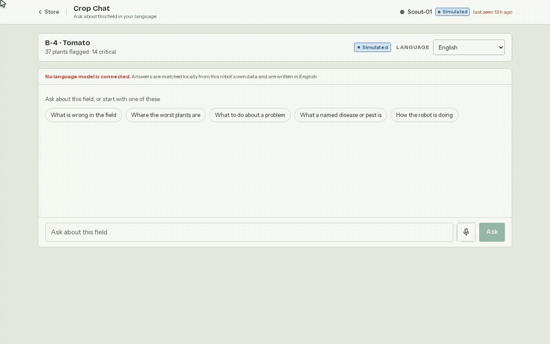

# Agri Robot App Store

A web platform where a farmer or operator opens four apps to control and analyse an
agricultural field robot: **Dashboard**, **Crop Scout**, **Crop Health Analytics** and
**Mission Planner**. The system talks to real robots over
**ROS 2 ↔ MQTT ↔ FastAPI ↔ WebSocket ↔ browser**, and ships with a **simulated robot**
that speaks exactly the same protocol, so the whole stack runs end to end with no hardware.

> **Current state: Phase 0 of 10 — scaffold.**
> The stack boots and every service is healthy, but the API exposes only health endpoints,
> the sim robot only connects and idles, and the web app renders a placeholder.
> See [docs/PLAN.md](docs/PLAN.md) for what each phase adds and
> [docs/ARCHITECTURE.md](docs/ARCHITECTURE.md) for the design.

## What it looks like

Recorded against a production build with Playwright driving a real Chromium — every value
on screen comes from the exported fixtures, and the "Simulated" badges are the app saying
so. To re-record after a UI change: `pnpm --filter @agri/web demo:gif [scene ...]`
(needs `ffmpeg` and a `pnpm build`; the scenes live in
[apps/web/scripts/record-demos.mjs](apps/web/scripts/record-demos.mjs)).

**The store** — browse the apps, filter by the job at hand, open one. There is no sign-in
step: the platform has no accounts yet, so the store is the entry point.



**Crop Scout** — drive the robot, watch both cameras, read what it flagged and where.



**Mission Planner** — pick a coverage pattern, switch modes, arm the sprayer. Only
autonomous mode can start a mission; remote control hides the button rather than
disabling it.



**Crop Health** — filter the hotspots by severity and open one to see it on the field map.



**Crop Chat** — ask about the field, in the operator's own language.



## Quick start

Requirements: Docker with Compose v2, Node 20 with pnpm 9, and [uv](https://docs.astral.sh/uv/).

```bash
make dev
```

That generates `.env` with fresh secrets, a local development CA and broker certificate,
the Mosquitto password file, installs dependencies, builds the images and starts everything.
Then:

| Service               | URL                                               |
| --------------------- | ------------------------------------------------- |
| Web                   | http://localhost:3000                             |
| API health            | http://localhost:8000/healthz                     |
| API docs              | http://localhost:8000/api/v1/docs                 |
| Object store (S3 API) | http://localhost:9000                             |
| Object store admin    | http://localhost:9333                             |
| MQTT                  | `localhost:1883` (plain) · `localhost:8883` (TLS) |

`make help` lists everything else. `make down` stops the stack; `make clean` also deletes
its volumes.

## Layout

```
apps/web/            Next.js App Router frontend (store + 4 apps)
packages/ui/         design tokens + component library
packages/contracts/  JSON Schemas (source of truth) + generated types
services/api/        FastAPI: REST, WebSocket gateway, MQTT ingest, command service
services/sim-robot/  standalone robot emulator over MQTT
robot/ros2_ws/       ROS 2 workspace, rclpy bridge package
infra/               Docker Compose, broker config, Dockerfiles, dev certs
docs/                ARCHITECTURE.md, PLAN.md, contracts/
```

## Verification

```bash
make lint          # eslint + ruff
make format-check  # prettier + ruff format
make typecheck     # tsc + mypy (strict)
make test          # vitest + pytest
```

## Notes for this machine

- ROS 2 Humble is installed at `/opt/ros/humble` and sourced from `~/.bashrc`. It puts its
  Python 3.10 `site-packages` on `PYTHONPATH`, which breaks the project's 3.12 virtualenvs.
  Every Makefile target runs Python with `env -u PYTHONPATH`; do the same if you invoke
  `uv run` by hand.
- `uv` was installed to `~/.local/bin`. Make sure that is on your `PATH`.

## Object storage

The brief specifies MinIO. MinIO withdrew its community container images and binaries during
Phase 0, so the S3 image store is [SeaweedFS](https://github.com/seaweedfs/seaweedfs)'s S3
gateway. It speaks the same S3 API, the application uses `aioboto3` against it unchanged, and
the substitution is confined to `infra/docker-compose.yml`.

## Safety

This software drives a physical machine that sprays pesticide. The safety rules in
[docs/ARCHITECTURE.md §4](docs/ARCHITECTURE.md) — teleop deadman, e-stop, sprayer
interlocks, control leases, audit logging — are enforced on the robot and in the backend,
never only in the browser. Do not weaken them.

## Simulated data

Every payload carries a `source` field set by its publisher (`"sim"` or `"robot"`). The UI's
"Simulated" badge is driven by that field alone. There is no frontend flag that can hide it.
